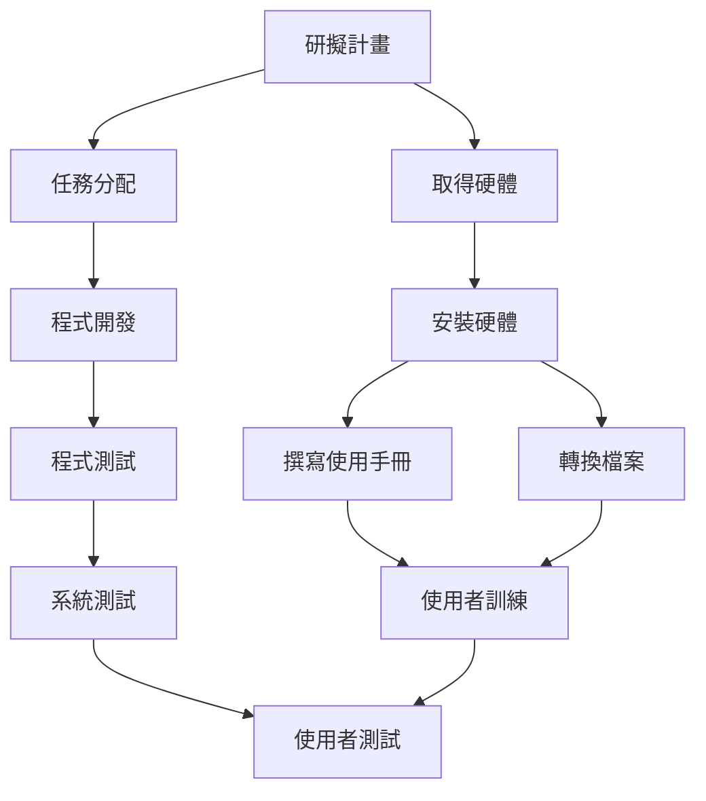
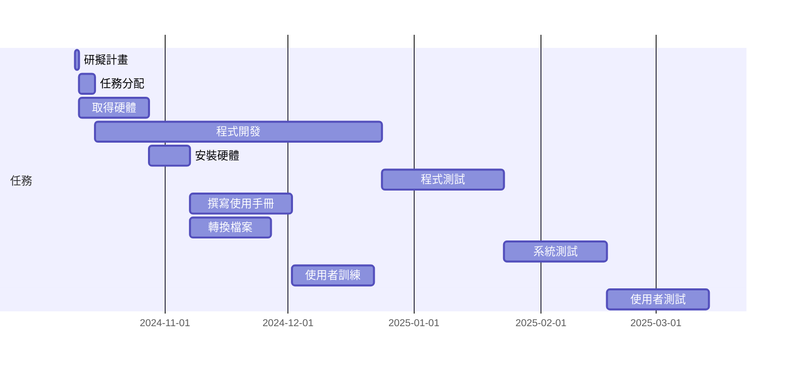

# hw2
### PERT/CPM 圖

```mermaid
graph TD
    1[研擬計畫] --> 2[任務分配]
    1 --> 3[取得硬體]
    2 --> 4[程式開發]
    3 --> 5[安裝硬體]
    4 --> 6[程式測試]
    5 --> 7[撰寫使用手冊]
    5 --> 8[轉換檔案]
    6 --> 9[系統測試]
    7 --> 10[使用者訓練]
    8 --> 10
    9 --> 11[使用者測試]
    10 --> 11
```
## 甘特圖

```mermaid
gantt
    dateFormat  YYYY-MM-DD
    section 任務
    研擬計畫:des1, 2024-10-10, 1d
    任務分配:des2, after des1, 4d
    取得硬體:des3, after des1, 17d
    程式開發:des4, after des2, 70d
    安裝硬體:des5, after des3, 10d
    程式測試:des6, after des4, 30d
    撰寫使用手冊:des7, after des5, 25d
    轉換檔案:des8, after des5, 20d
    系統測試:des9, after des6, 25d
    使用者訓練:des10, after des7 des8, 20d
    使用者測試: des11, after des9 des10, 25d
```
## 關鍵路徑：1(研擬計畫) → 2(任務分配) → 4(程式開發) → 6(程式測試) → 9(系統測試) → 11(使用者測試)，共計155天。
